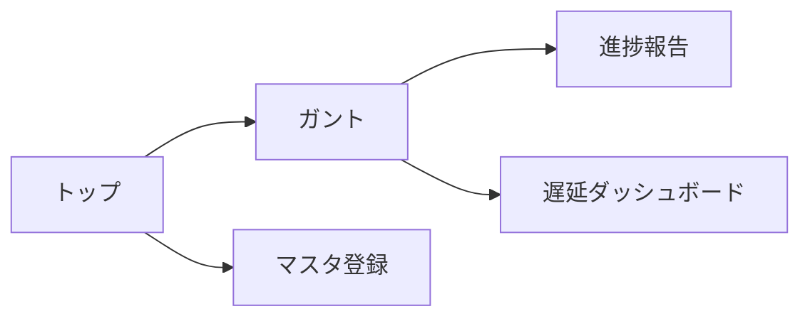

# 画面仕様

> 画面構成・遷移・操作フロー・主要 UI 要素の最新状態を記録する。
> 画面に関する判断は本書を更新してから実装に着手する (`CLAUDE.md` 参照)。

## 1. 画面一覧

| ID | 画面名 | パス | 概要 | 状態 |
|----|--------|------|------|------|
| S01 | トップ(ダッシュボード) | `/` | 各機能への入口 | 実装済 |
| S10 | 新規プロジェクト | `/new` | 名称入力+起点選択(見積から/ガントから) (US-020) | 実装済 |
| S02 | 要件 | `/requirements` | プロジェクト選択/作成 + 要件の入力・一覧 (US-001) | 実装済 |
| S03 | ガントチャート | `/manage/gantt` | 計画/進捗を時系列表示。初版生成は新規作成の「見積」で行い、本画面は「スケジュール再生成」(US-004/029) | 実装済 |
| S04 | 設定 | `/settings` | タブ(基本設定/要員/休日/参照資料/プロジェクト)。プロジェクト削除は「プロジェクト」タブ (US-022/024/030) | 実装済 |
| S05 | 進捗報告 | `/reports` | 要員がタスクの進捗率を報告し進捗へ反映 (US-007/008) | 実装済 |
| S07 | 日報 | `/daily` | 複数タスクの進捗をダイアログで一括登録/一覧/詳細、ガント反映 (US-017) | 実装済 |
| S08 | WBS編集 | `/wbs` | 一覧表上で階層タスクを直接 追加/削除/修正 (US-018) | 実装済 |
| S09 | 取込 | `/import` | 自然文/ファイル(xlsx/csv)から要件・見積明細を取込 (US-019) | 実装済 |
| S06 | 遅延ダッシュボード | `/delays` | 遅延タスク(US-009)・遅れ要員(US-010)・リカバリ案(US-011) | 実装済 |

ルーティングは `react-router-dom` (`frontend/src/main.tsx`)。**US-021 でシェルを刷新**:
- `/` ランディング(入口分離): 新規作成 / 進捗管理 / 設定
- `/create/*` 新規作成系(ヘッダ + コンテンツ。ステッパーは US-023): new(index)/requirements/import/tasks/estimate/wbs
- `/manage/*` 進捗管理系(共通シェル: ヘッダ右上に参照プロジェクト選択 `ProjectContext`、左ペインメニュー): gantt/reports/daily/delays
- `/settings` 設定(US-021 暫定、US-022 でタブ化)
- テーマは淡い緑系統、フォントは M PLUS Rounded 1c、アイコンは自前 SVG ピクトグラム (`components/Icon.tsx`)。

## 2. 画面遷移

## 3. 各画面の仕様

### S01 トップ(要員一覧) — 実装済(最小)

- **目的**: frontend↔backend 疎通の確認と、要員マスタ(US-005)の一覧表示。
- **表示項目**: 要員名(role があれば括弧書き)。
- **状態表示**: 読み込み中 / 0 件 / API エラー(`role="alert"`)。
- **遷移**: (今後 S02〜S05 への導線を追加)。

### S02〜S05

未着手。各 US の実装時に本書を更新してから着手する。

## 4. 共通 UI

- ヘッダ: アプリ名 (`.app-header`)。
- カード: コンテンツ枠 (`.card`)。
- **デザインシステムの一次正**: [`frontend/src/styles/app.css`](../frontend/src/styles/app.css)。color / spacing / radius の token はここに集約し、他所に同等定義を置かない。
