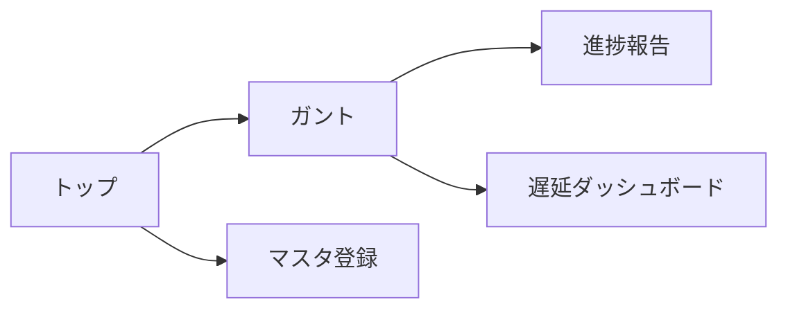

# 画面仕様

> 画面構成・遷移・操作フロー・主要 UI 要素の最新状態を記録する。
> 画面に関する判断は本書を更新してから実装に着手する (`CLAUDE.md` 参照)。

## 1. 画面一覧

| ID | 画面名 | パス | 概要 | 状態 |
|----|--------|------|------|------|
| S01 | トップ(ダッシュボード) | `/` | 各機能への入口 | 実装済 |
| S10 | プロジェクト作成 | `/create` | 名称/区分入力→作成→非活性ロック+やり直し+次へ (US-020/038) | 実装済 |
| S02 | 要件登録 | `/create/requirements` | 要件一覧(見積明細)ファイル1つ/自然文で要件登録(WBS展開なし) (US-001/038) | 実装済 |
| S03 | ガントチャート | `/manage/gantt` | 左=WBS3階層ツリー(折り畳み)/右=稼働時間軸の連続バー(小数日・コマ無し)。工数(人日)ヘッダ・日付は年込み・右ペイン全幅 (US-004/029/040) | 実装済 |
| S04 | 設定 | `/settings` | タブ(基本設定/要員/休日/参照資料/プロジェクト)。プロジェクト削除は「プロジェクト」タブ (US-022/024/030) | 実装済 |
| S05 | 進捗報告 | `/reports` | 要員がタスクの進捗率を報告し進捗へ反映 (US-007/008) | 実装済 |
| S07 | 日報 | `/daily` | 複数タスクの進捗をダイアログで一括登録/一覧/詳細、ガント反映 (US-017) | 実装済 |
| S08 | WBS編集(手組み) | `/create/wbs` | 一覧表上で階層タスクを直接 追加/削除/修正→ガント生成 (US-018/038) | 実装済 |
| S09 | 見積・ガント生成 | `/create/estimate` | 起点選択(AIガント/AI見積/手組み)+見積調整+ガント生成 (US-019/036/037/038) | 実装済 |
| S06 | 遅延ダッシュボード | `/delays` | 遅延タスク(US-009)・遅れ要員(US-010)・リカバリ案(US-011) | 実装済 |

ルーティングは `react-router-dom` (`frontend/src/main.tsx`)。**US-021 でシェルを刷新、US-038 で新規作成フローを 3 ステップに簡素化**:
- `/` ランディング(入口分離): 新規作成 / 進捗管理 / 設定
- `/create/*` 新規作成系(ヘッダ + 3 ステップのステッパー。作成中プロジェクトは `CreateContext` で共有):
  - **1. プロジェクト作成** (`/create`): 名称・概要・案件区分(新規/既存)・参照資料を入力し作成。**作成後は入力を非活性表示**にし、「やり直し」(作成中プロジェクトを破棄)と「次へ:要件登録」のみ可能 (US-038)。
  - **2. 要件登録** (`/create/requirements`): **「要件一覧(見積明細)ファイル」1 つ**の取込 or 自然文で要件登録。**取込時に WBS は展開しない**。見積明細の二重アップロードは廃止 (US-038)。
  - **3. 見積・ガント生成** (`/create/estimate`、手組みは `/create/wbs`): 「**AI で見積を生成**」(US-036)または「手で WBS を組む」。**WBS はこの段で生成**。AI見積は**ガントへ直行せず**、表で 工数・稼働率・見積根拠・担当 を確認・補正(担当割付もここ, US-039)。レビュー自動展開・効率化調整もここ。「**この見積でガントを作成 →**」の明示操作で初めて `scheduleTasks` でガント生成し進捗管理へ。AI は Claude Code 契約枠で実行(API 課金なし)。**ReqTrack 本体は Web アプリで VSCode 起動は不要**。
  - 旧 `/create/import`・`/create/tasks` は廃止(requirements・estimate へリダイレクト)。
- `/manage/*` 進捗管理系(共通シェル: ヘッダ右上に参照プロジェクト選択 `ProjectContext`、左ペインメニュー): gantt/**wbs(WBS編集, US-041)**/reports/daily/delays。**ガント(計画済みタスク)を持つプロジェクトが無い場合は遷移不可で案内表示 (US-032)**
  - **WBS編集** (`/manage/wbs`): 実行中にタスク追加/削除/変更・工数/稼働率/担当を編集(`WbsEditor` を新規作成と共有)→「スケジュール再生成」で反映。再生成は依存(同一対象配下=工程順直列)+要員(同一担当直列・別担当並行)を開始日起点で考慮 (US-041)。
- `/settings` 設定(US-021 暫定、US-022 でタブ化)
- テーマは淡い緑系統、フォントは M PLUS Rounded 1c、アイコンは自前 SVG ピクトグラム (`components/Icon.tsx`)。

## 2. 画面遷移

## 3. 各画面の仕様

### S01 トップ(要員一覧) — 実装済(最小)

- **目的**: frontend↔backend 疎通の確認と、要員マスタ(US-005)の一覧表示。
- **表示項目**: 要員名(role があれば括弧書き)。
- **状態表示**: 読み込み中 / 0 件 / API エラー(`role="alert"`)。
- **遷移**: (今後 S02〜S05 への導線を追加)。

### S02〜S05

未着手。各 US の実装時に本書を更新してから着手する。

## 4. 共通 UI

- ヘッダ: アプリ名 (`.app-header`)。
- カード: コンテンツ枠 (`.card`)。
- **デザインシステムの一次正**: [`frontend/src/styles/app.css`](../frontend/src/styles/app.css)。color / spacing / radius の token はここに集約し、他所に同等定義を置かない。
